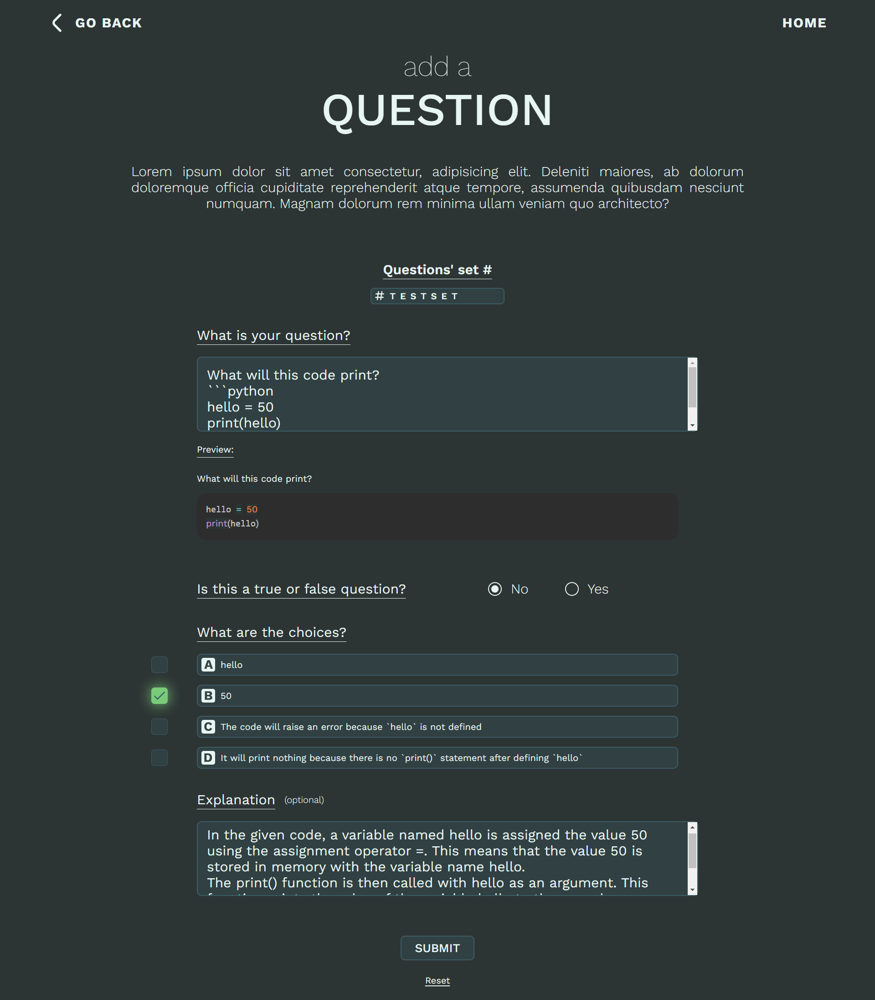
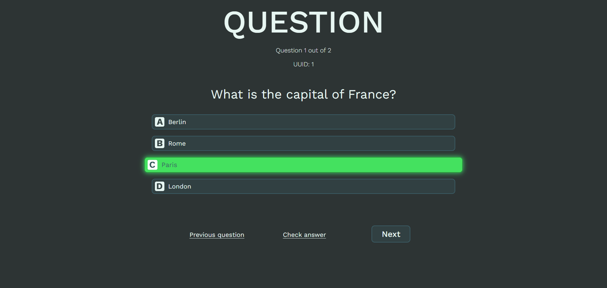
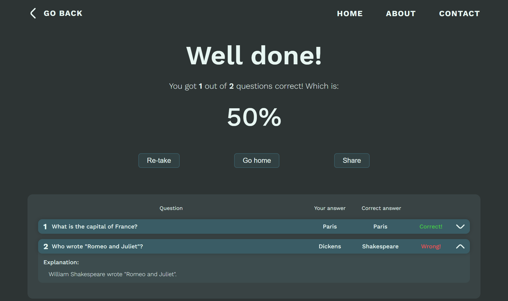

# Quiz Website API

This is a FastAPI application for a Quiz Website. It provides various endpoints to interact with the quiz data.

### Developmental screenshots
- Users can submit questions and view them on the website:



- In-quiz view:



- End screen/score view:


## Frontend

- Frontend for API:
Located in the [pages](./page) and [assets](./assets) folders.
- Implemented using JQuery and Sassy CSS.
- Initial designs made using Photoshop can be found in the [design](./design) folder.


## Getting Started

These instructions will get you a copy of the project up and running on your local machine for development and testing purposes.

### Prerequisites

- Python
- pip
- MySQL

### Installing

1. Clone the repository
2. Install the dependencies:

```bash
pip install -r ./api/requirements.txt
```

3. Set up your environment variables in `superdupersecret.env` file.

4. Run the application:

```bash
uvicorn main:app --reload
```
(Make sure to run this command from the `api` directory)

## API Endpoints

- `GET /`: Root endpoint that returns a welcome message.
- `GET /api/question`: Endpoint to get all questions.
- `GET /api/question/{id}`: Endpoint to get a specific question by its ID.
- `POST /api/question`: Endpoint to add a new question.
- `GET /api/quiz/random`: Endpoint to get a random question.
- `GET /api/quiz/random/{amount}`: Endpoint to get a specific number of random questions.
- `GET /api/quiz/set/setinfo`: Endpoint to get all sets.
- `GET /api/quiz/set/setinfo/{setCode}`: Endpoint to get a specific set by its code.
- `GET /api/quiz/set/questions/{setCode}`: Endpoint to get all questions in a specific set.
- `GET /api/quiz/set/questions/{setCode}/{numberOfQuestions}`: Endpoint to get a specific number of questions in a specific set.

## Built With

- [FastAPI](https://fastapi.tiangolo.com/)
- [SQLAlchemy](https://www.sqlalchemy.org/)
- [PyMySQL](https://pymysql.readthedocs.io/en/latest/)

## Authors

- Amr Yousef
